# Objectives
- Testing the impact of the represented variability in the dataset.
- Stopping criterion: testing other metrics (Kullback-Liebler, Kolmogorov-Smirnov, ?)
- Search the origin of models that have a clear break in the dataspace.
- Test rejection sampling at each iterations (e.g., select only the 90% best fits)
- Stopping criterion: testing on the RMSE distributions instead of the models? Coupled with RMSE filtering?
- Implement and test rejection sampling and Geopsy on the datatset
- Add RMSE on the bi-triangular figure?
- Test different mixing ratios and see if same results but faster/slower. Seek for optimum quality/time.
- Falsifying the prior by testing a 5(?) layers model to predict a true 3-layers model.
- *Research*: computing likelihood with correlated noise.
- *Research*: non-linear CCA

# Observations:

## Testing the impact of the accepted data variance on the predictions:
During the tests, I observed that the fit for the first dimension dramatically increases if taking into account 95% of the variability instead of the typical 90%. This expalains the poor fit observed for the first layer whose results significantly differed from the one obtained via DREAM. The results are globally better.

I also observed in the meantime that the number of dimensions requiered for the representation at a given variability increases with iterations. This makes a lot of sens since the variability is decreasing with the iterations and therefor to explain the same variance percentage means a much lower absolute variance. This also confirms that the method performs accordingly to what is expected as the added models are supposed to improve the prior around the searched area.

## Distance metric between iterations:
With the assistance of Frédéric N., I was able to test multiple metrics. However, they were not all performing equivalently.

### Wasserstein distance:
The Wasserstein distance (or Earth-Mover distance) computes the work requiered to "transport" a given distribution of points towards another. This is therefor a very powerfull metric since it is directly linked to the samples. However, its behaviour is somewhat unpredictable and the threshold needed for False negatives to be lower than 5% varies with the type of distributions (see Figures below).

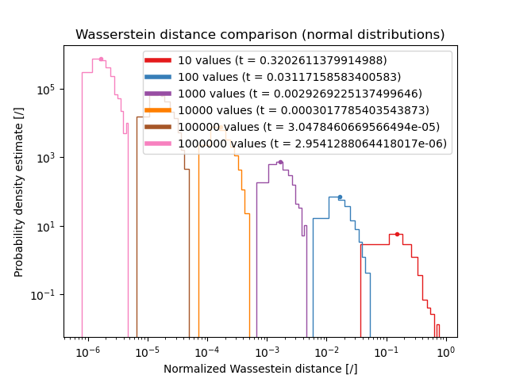
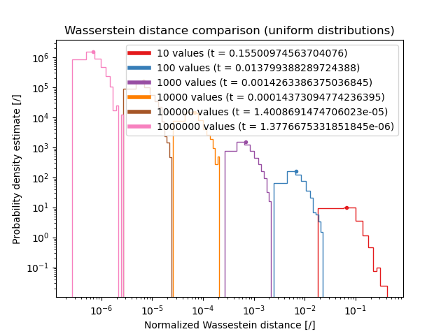

This poses significant issues for the application in BEL1D iterations since the distributions are not following a specific distribution. Thus, using a given threshold as a function of the number of models (linear relathionship) would also requier to attribute a distribution type, complexe if not impossible.

### Kullback-Liebler distance:
The Kullback-Liebler distance (also called entropy) has a very simple formula and is classically used in statsistics to differ two distributions. However, it requeiers to transform point clouds into histograms in order to work, since it deals with probabilities and not with samples. Therefor, it directly introduces a biais into thge computations since the histogram is only a simplified representation of the samples. 

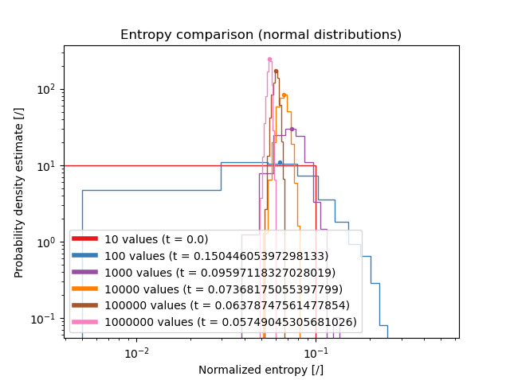
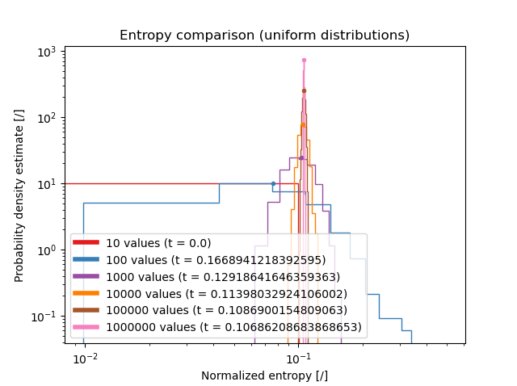

In the Figures above, we can observe that the threshold varies non-linearly and that it differs according to the distribution type.
This poses some issues and is thus not optimal for our case.

### Kolmogorov-Smirnov test:
The 2 samples Kolmogorov-Smirnov test compares two distributions and test the null hypothesis that they are both the same. It returns a probability that the null hypothesis is false. It is classically admitted that 5% of p-value is a good treadoff between fast computations and sufficient fit. The method is based on the empirical CDFs (Cumulative Distribution Functions) and thus unbiased. As an example, you can see the Figure below showing that the 5% threshold corresponds to the approximate value for the 5% of false negatives.

However, using 5% as the threshold gives stange results and leads to erratic convergence (the p-value goes all around until it reaches 5%). We will thus rather use the KS statistc variable, describing the maximim distance between the empirical CDFs. The advantage of this metric is that it is automatically normalized between 1 and 0 by the definition of the CDF. The threshold defined is found as in the previous cases. However, in this case, the number of models in the system does not infer on the results.

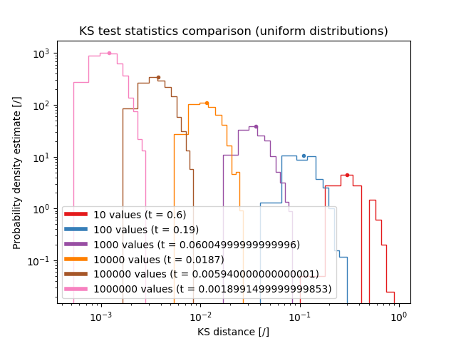

Since it appears that only the number of samples interfers with the computed distance significantly, we will use this criterion as the one for convergence. The choosen threshold is the one that will ensure that if the distributions are the same as for the testings done, the chance of rejecting the similaritudes is lower than 5%. This threshold is defined in the Figure below and follows the law:

Threshold(N) = A * N**(-0.5)

where: 
- N is the number of models sampled at both iterations (if different, resample for same sizes approximately)
- A and k are fitted variables (a\~1.87, see Figure below)

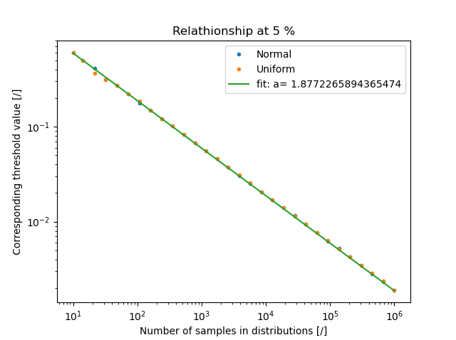

If we lower the threshold at 1%, the behaviour remains similar but the equation is different (a\~2.18, see Figure below)

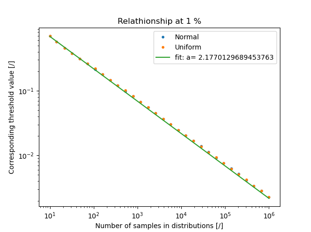

In contrary, if we increase the threshold to 10%, we obtain a\~1.62 (see Figure below).

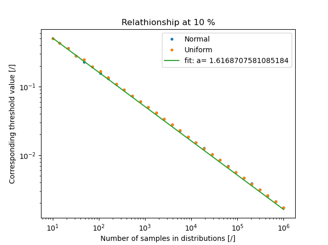

In summary, we can see that according to the different threshold, the relationship remains linear in the log-log space and is simply shifted (see Figure).

## Origin of odd models in the prior/posteriors

When using the forward model, some models are returning datasets that presents and important break in the dispersion curve. This is not supposed to appen normaly. An example of those od models is presented in the figure below. They usually correspond to the highest RMSE but the should not be present in the first place.

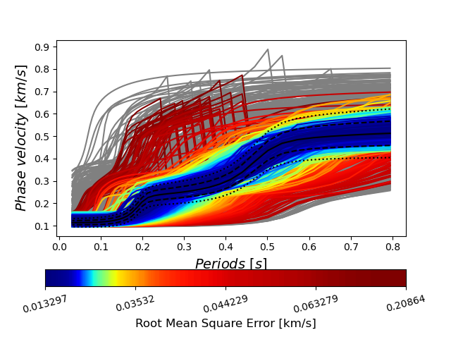

If we isolate the models, there is no obvious reason for their strange behaviour. We could imagine that those models are originating from low velocity zones or alike, but it is clearly not the case. 
 
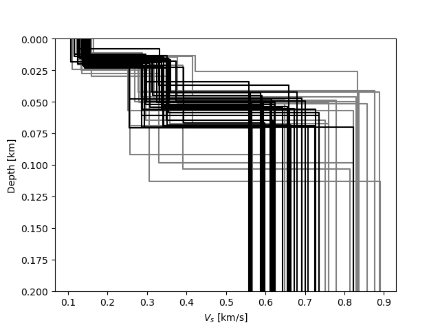 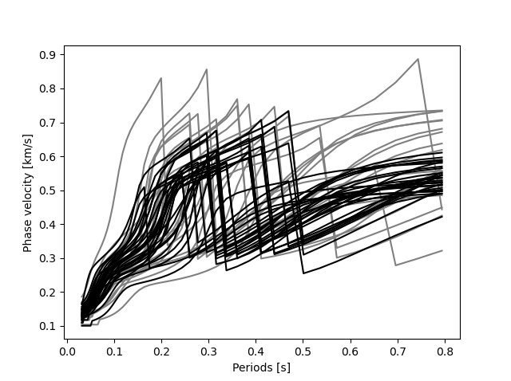

The Poisson's ratio are also explored. It gives no further info on why this is happenning. Everything is located in reasonable ranges and nothing appears problematic. The only lead that can be imagined from this analysisi is that the odd behaviour is caused by a strong change in the Poisson's ratio between the layers.

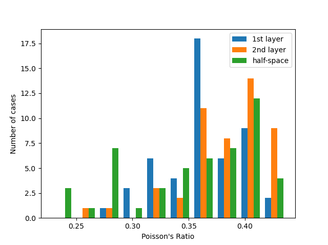 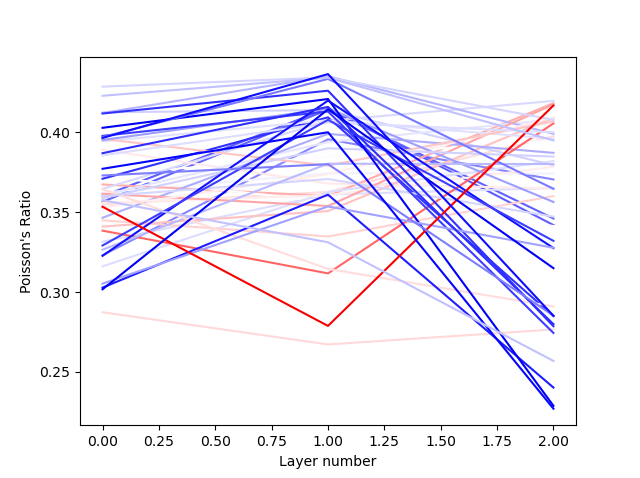

To check this hypothesis, we compute the Poisson's ratio for every sampled model in the uniformely distributed space (prior) and observe what is the way the ratio evolves for the other models.

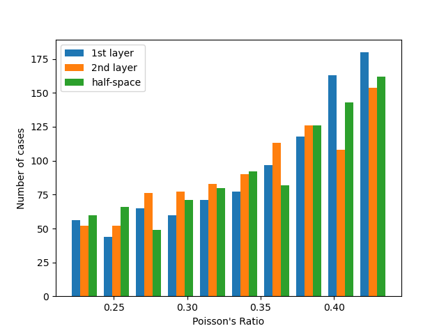 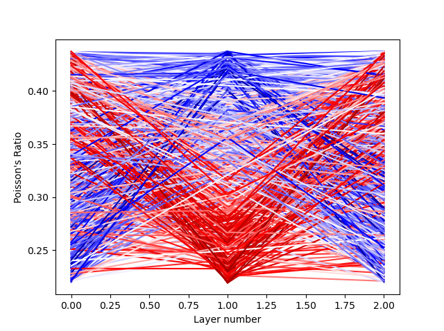

If we analyze the variability of the Poisson's ratio for the model, no particular tendancy is detected either. 

In conclusion, I have no idea why those models are present but they are non-phyisically consistent. Therefore, from there on, we will remove them from the models and see how the situation evolves. To do so, we will simply remove the outliers in the distribution of maximum absolute variability. This will remove the most problematic models and proved effective in our testings. We define the maximum absolute variability as:

MaxVar = max(abs(d(1:-1)-d(0:-2)))

where d is a single dataset with di beeing the i-th point in the dataset.

An outlier is defiend as beiing more than 3 times the scaled Median Absolute Deviation away from the median of the variabilities (definition from Matlab).

## Rejection sampling at each iteration:
Since at every iteration we need to compute the forward model, it is possible to select the best models only. To do so, we will compute the RMSE of the models and add models of the X-percent best fit from the posterior of previous iteration to the prior for the current iteration. This approach is expected to improve convergence. This indeed improves dramatically convergence. With such approach, we are much closer to a McMC algorithm, however, we are still able to fully leverage the parralel capabilities of the used computer, which is not the case for McMC algorithms.

Results show that we are converging approximately 33% faster using only the 75% best fits while still converging towrads the same posterior.

